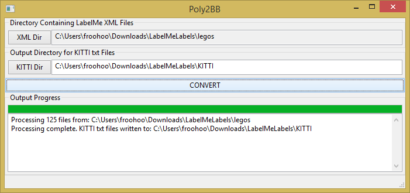

# poly2BB

Polygon to Bounding Box (poly2BB) is a utility for converting the XML annotations produced by MIT's [LabelMe Tool](http://labelme.csail.mit.edu "MIT Label Me") into the [KITTI](http://www.cvlibs.net/datasets/kitti/index.php "Karlsruhe Institute") annotation format. The original impetus for puting poly2BB together was that I had annotated my data in LabelMe, but the training tool I was using at the time, Nvidia Digits, only supported the KITTI format. LabelMe also has extended functionality like image masking but  Poly2BB currently only converts the polygon information as well as a limited conversion of the occluded tag.

## Requirements:
- Python
- wxPython (to run GUI version)



## LabelMe Format

LabelMe annotations are stored as XML as an annotation element.  Within the annotation element the tags are:
```
 - filename:       name image file associated with this annotation
 - folder:         parent directory of image file on the LabelMe server
 - source:         user who uploaded image
 - object:         an annotated object
 - imagesize:      image dimensions
 - object:         an annotated object within the image
```
 Each object contains n coordinates of a polygon (pt elements). Since the KITTI format only supports bounding boxes poly2BB defines the bounding box by extracting the largest and smallest x and y coordinates from the polygon. 

 ## KITTI Format
 Chart below from [https://github.com/NVIDIA/DIGITS/tree/master/digits/extensions/data/objectDetection](https://github.com/NVIDIA/DIGITS/tree/master/digits/extensions/data/objectDetection)
 ```
 #Values    Name      Description
----------------------------------------------------------------------------
   1    type         Describes the type of object: 'Car', 'Van', 'Truck',
                     'Pedestrian', 'Person_sitting', 'Cyclist', 'Tram',
                     'Misc' or 'DontCare'
   1    truncated    Float from 0 (non-truncated) to 1 (truncated), where
                     truncated refers to the object leaving image boundaries
   1    occluded     Integer (0,1,2,3) indicating occlusion state:
                     0 = fully visible, 1 = partly occluded
                     2 = largely occluded, 3 = unknown
   1    alpha        Observation angle of object, ranging [-pi..pi]
   4    bbox         2D bounding box of object in the image (0-based index):
                     contains left, top, right, bottom pixel coordinates
   3    dimensions   3D object dimensions: height, width, length (in meters)
   3    location     3D object location x,y,z in camera coordinates (in meters)
   1    rotation_y   Rotation ry around Y-axis in camera coordinates [-pi..pi]
   1    score        Only for results: Float, indicating confidence in
                     detection, needed for p/r curves, higher is better.
```
 ### Sample of an output KITTI file

Below is a sample of a file that was processed by poly2BB. In this case, there are 16 objects that were present in the LabelMe  annotation.

 ```
lego_or_2x2_plate 0.0 0 0.0 843 563 1091 795 0.0 0.0 0.0 0.0 0.0 0.0 0.0 
lego_or_2x1_plate 0.0 0 0.0 595 292 813 491 0.0 0.0 0.0 0.0 0.0 0.0 0.0 
lego_bk_1x1_plate 0.0 0 0.0 1191 1242 1337 1386 0.0 0.0 0.0 0.0 0.0 0.0 0.0 
lego_or_d1_lens 0.0 0 0.0 762 804 874 912 0.0 0.0 0.0 0.0 0.0 0.0 0.0 
lego_or_1x4_scallop 0.0 0 0.0 1739 1054 1956 1475 0.0 0.0 0.0 0.0 0.0 0.0 0.0 
lego_bk_1x6_plate 0.0 0 0.0 1346 343 1729 917 0.0 0.0 0.0 0.0 0.0 0.0 0.0 
lego_gn_d1_lens 0.0 0 0.0 1385 222 1498 335 0.0 0.0 0.0 0.0 0.0 0.0 0.0 
lego_1x12_wt_plate 0.0 0 0.0 407 770 1351 1560 0.0 0.0 0.0 0.0 0.0 0.0 0.0 
lego_cl_d2_lens 0.0 0 0.0 446 412 649 611 0.0 0.0 0.0 0.0 0.0 0.0 0.0 
lego_gy_r3_qtr-cir-plate 0.0 0 0.0 1677 410 1984 719 0.0 0.0 0.0 0.0 0.0 0.0 0.0 
lego_gy_r3_qtr-cir-plate 0.0 0 0.0 1836 711 2208 1028 0.0 0.0 0.0 0.0 0.0 0.0 0.0 
lego_gy_2x4_plate 0.0 0 0.0 910 1214 1286 1648 0.0 0.0 0.0 0.0 0.0 0.0 0.0 
lego_gy_4x2_isotrap 0.0 0 0.0 835 236 1115 576 0.0 0.0 0.0 0.0 0.0 0.0 0.0 
lego_wt_2x6_plate 0.0 0 0.0 1328 1130 1790 1735 0.0 0.0 0.0 0.0 0.0 0.0 0.0 
lego_gy_2x2_block-axle 0.0 0 0.0 850 794 1132 1041 0.0 0.0 0.0 0.0 0.0 0.0 0.0 
lego_figure_pilot 0.0 0 0.0 360 983 884 1316 0.0 0.0 0.0 0.0 0.0 0.0 0.0 
```
